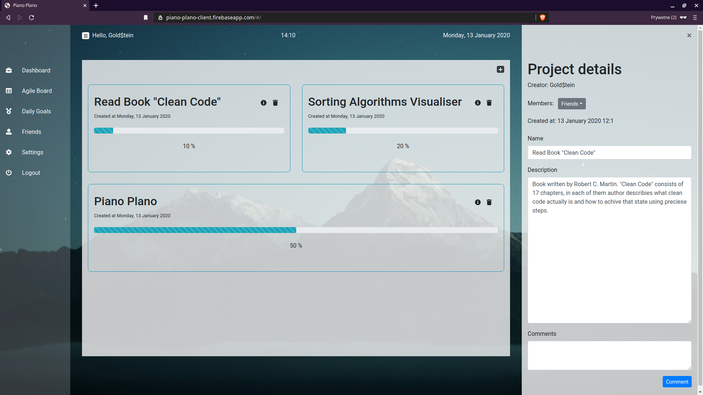
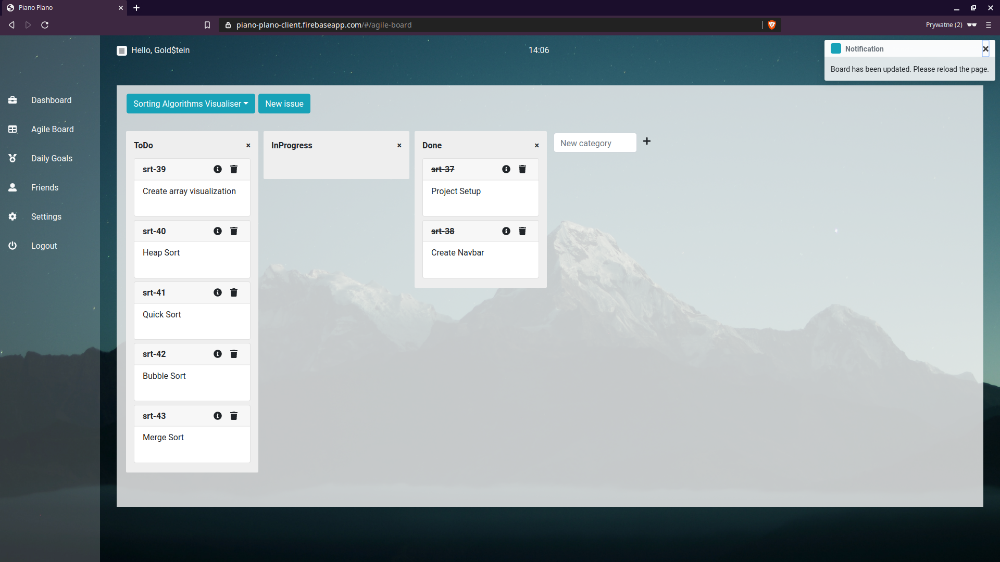
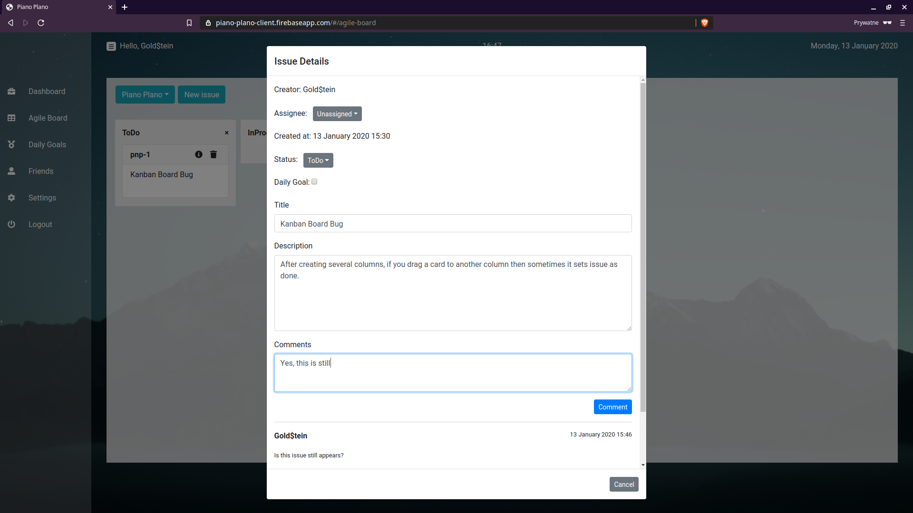
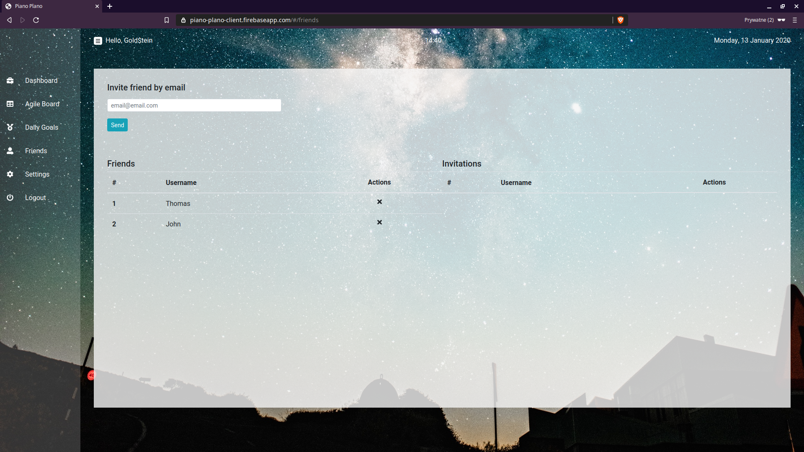
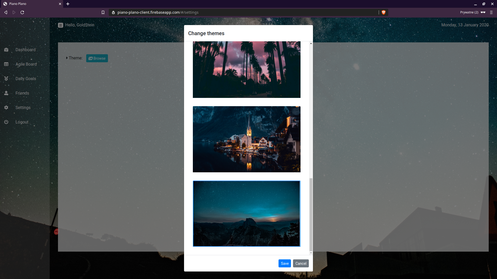
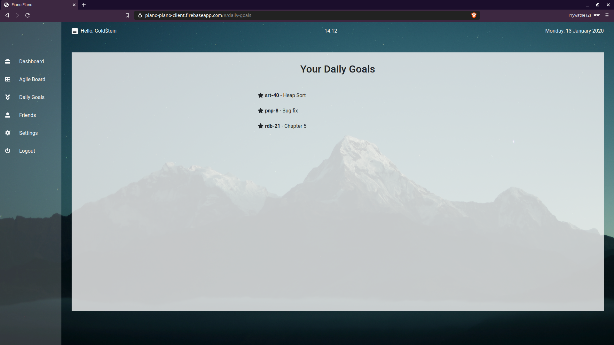

# General

## Links
* [Working demo]()
* [Backend Repo](https://github.com/ErnestZiemkowski/piano-plano)

# Installation

## Using Docker (recommended)
If you want to run whole infrastructure just type:
* `docker-compose up`

If you want to spin just this container:
* `docker run -d --name=piano-plano-client -p 6000:6000 -e API_URL=http://localhost:5000 ernestziemkowski/piano-plano-client` 

## Oldshool way
Make sure you have already set up [backend repo](https://github.com/ErnestZiemkowski/piano-plano) and it is running. If so, go ahead and follow these instructions:

* `git clone git@github.com:ErnestZiemkowski/piano-plano-client.git`
* `cd piano-plano-client`
* `npm install`
* Go to `.env` and set your backendURI
* `npm start`

# Features
* Create Projects and divide its work into atomic issues
* Manage those issues via transparent Kanban Board
* Start discussion over a project or issue
* Assign issues to particular project members
* Set issues as your daily goals
* Invite friends and participate together in your projects 

# Real user experience screenshots

